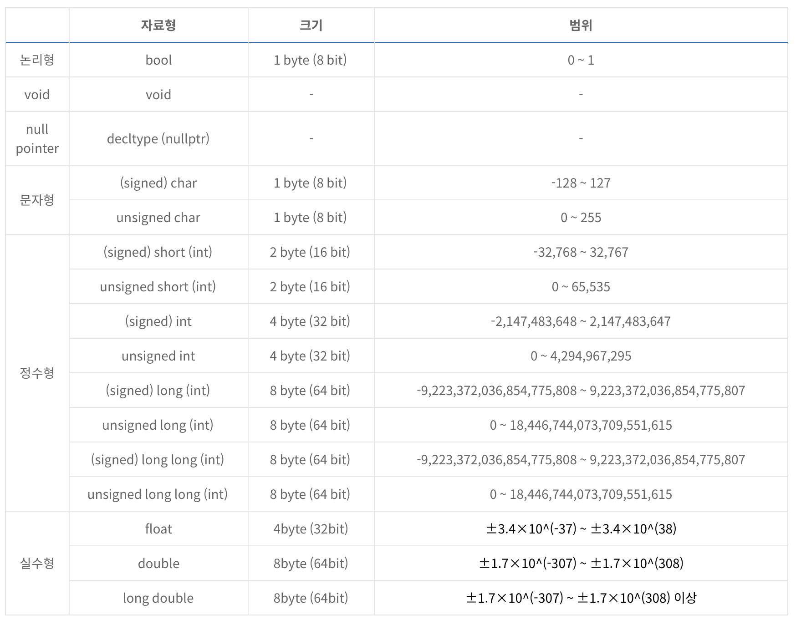

# 공간복잡도
문제를 풀 때 시간복잡도와 달리 공간복잡도는 많이 고려하지는 않는다.     
 
 
문제에서 공간복잡도 활용법
- 문제에 나와있는 최대 공간을 배열에 할당
- 문제에 제한 공간을 메모리에 할당

하지만 메모리 제한을 보고 하지는 않는다.  
 
 

# 자료형 별 공간복잡도
- 64bit 기준

 
 

## 많이 쓰는 자료형의 크기
|자료형|크기(byte)|범위|
|--|--|--|
|short|1 byte|-128~127|
|int|4 byte|-2,147,483,648 ~ 2,147,483,647|
|long, long long|8 byte|-9,223,372,036,854,775,808 ~ 9,223,372,036,854,775,807|
|float|4 byte|±3.4×10^(-37) ~ ±3.4×10^(38)|
|double|8 byte|±1.7×10^(-307) ~ ±1.7×10^(308)|