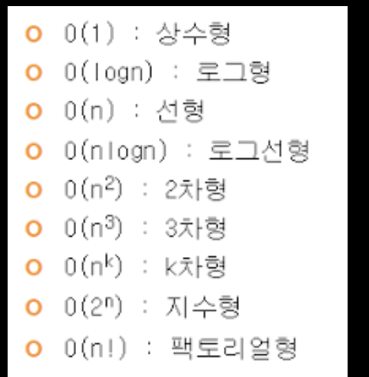

# 시간복잡도
- 어떠한 알고리즘이 실행되는데 걸리는 시간
- 주요 로직의 반복 횟수를 중점을 측정
 
 

# 빅오표기법
복잡도에 가장 영향을 미치는 항의 상수 인자를 빼고 나머지 항을 없애서 나타내는 표기법
 

## 빅오 크기 순서
- 아래로 내려갈수록 시간 복잡도가 높은 것

 
 

## 로그
$\log_{2}{(x)}$ : 2를 몇 번 곱해야지 x가 되냐는 뜻
 
$\log_{2}{(32)} = 5$ : 2를 5번 곱하면 x인 32가 된다.
 
 

# 재귀함수 시간복잡도
재귀 함수의 main logic * 함수 호출 횟수
- 재귀 함수 안에서 자신을 k번 호출한다면      
  시간복잡도 : $k^n$
 
 

# 자료구조에 따른 시간복잡도

