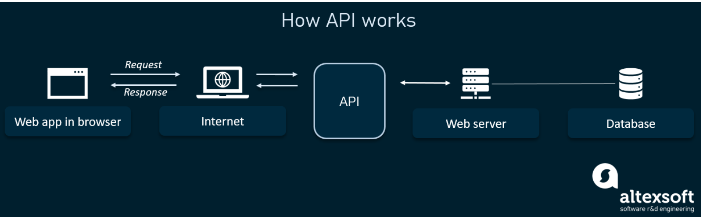

# API
- API : 두 개 이상의 컴퓨터가 서로 통신을 할 수 있게 중간에서 형식을 제공해주는 메커니즘
 

ex) 기상청 데이터베이스에는 일일 기상 데이터가 들어있다. 내 앱에서 해당 일일 기상 데이터를 사용하기 위해서 기상청의 api를 사용한다. 기상청의 api에는 어떤 값을 input으로 주면 어떤 값을 output으로 줄께가 명시되어있다. 이게 **API**다.

- web app 과 server 중간에서 통신할 수 있게끔 **API**가 위치해 있다.
___
 
 

## API 장점
___
1. 제공자(API를 작성한 쪽)는 중요한 부분을 드러내지 않아도 된다.
  - input과 ouput만 기재하므로 중간에 처리 과정은 드러내지 않아도 된다.
2. 사용자 (API를 쓰는 쪽)은 복잡한 중간 과정을 모르고도 사용할 수 있다.
3. OPEN API의 경우 앱 개발 과정을 단순화하고 비용 절약
    - open api : 누구나 사용할 수 있게 공개된 api
      - 프로젝트에서 해당 프로젝트를 위해 만든 api는 공개가 되지 않고 해당 프로젝트에서만 사용하게끔 한다.
      - open api는 이와 달리 누구든 사용할 수 있게끔 공개되어 있는 api를 말한다.
