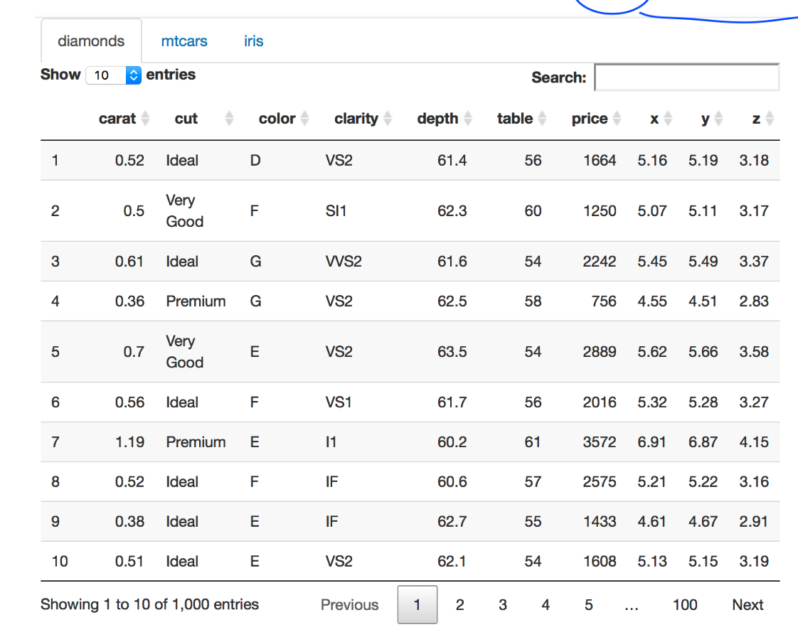

# 데이터
- 데이터 : 이론을 세우는 데 기초가 되는 사실이나 자료
<br/>
- 데이터의 종류 :
  - 테이블 형태의 데이터
  
  - 재귀적인 데이터
  
    - 좋아하는 것 이라는 key에 두개의 value인 아령과 바나나가 있고    
    해당 value가 다시 키가 되어 각각 10kg,육간형과      
    초록색이라는 value가 있다.

이렇듯 데이터는 복잡성이 있으므로 컴퓨터끼리 데이터를 주고 받으려면   
**'형식'** 이 필요합니다.
이 형식에 두가지가 있습니다.
- JSON
- XML
___
<br/>
<br/>

# JSON (JavaScript Object Notation)
- javascript 문법으로 데이터를 표현하기 위한 표준 포맷
<br/>
<br/>

## 예시1
___
  
```javascript
{
    "name" : "kundol",
    "like" : {
        "아령" : {
            "weight" : "10kg", 
            "feature" : "육각형"
        },
        "바나나" : {
            "color" : "초록색" 
        }
    } 
}
```
<br/>
<br/>

## 예시2
___
```
지브리OST리스트
- 마녀 배달부 키키(따스함에 둘어쌓인다면)
- 하울의 움직이는 성(세계의 약속)
```
``` JavaScript
{
    "지브리OST리스트" : [
        {
            "name" : "마켜 배달부 키키",
            "song" : "따스함에 둘러쌓인다면"
        }
        {
            "name" : "하울의 움직이는 성",
            "song" : "세계의 약속"
        }
    ]
}
```
- 배열은 대괄호([ ]) 사용
- key value 관계는 중괄호 ({ }) 사용
___
<br/>
<br/>

## Json을 쓰는 이유
___
- JSON.parse() 명령어 하나로 위의 json 데이터 포맷을 객체로 만들 수 있음
- 객체로 만들면 값에 접근 가능 (접근도 쉬움)
  - 접근 방법 :   
  >>> a.지브리OST리스트[0].name     
  >>> a.지브리OST리스트[0]["name"]      

- 사람과 컴퓨터 모두 읽고 쓰기 쉬움
- 프로그래밍 언어가 다른 환경에서도 사용 가능
  - 즉 어떤 언어든 플랫폼이든 상관없이 **서로 다른 시스템** 간에 교환하기 좋음
___
<br/>
<br/>

## JSON 주의할 점
___
JSON은 순수 데이터 포맷
- 오직 key-value 관계만 가능
- ~~메서드~~ 안됨
- ~~작은 따옴표~~ 안됨
- 큰 따옴표만 가능
___
<br/>
<br/>

## JSON 자료형
___
- ~~undefined~~ ~~메서드~~ 안됨
- 수(number)
- 문자열 (string)
- 참/거짓 (boolean)
- 배열 (array)
- 객체 (object)
- null
___
