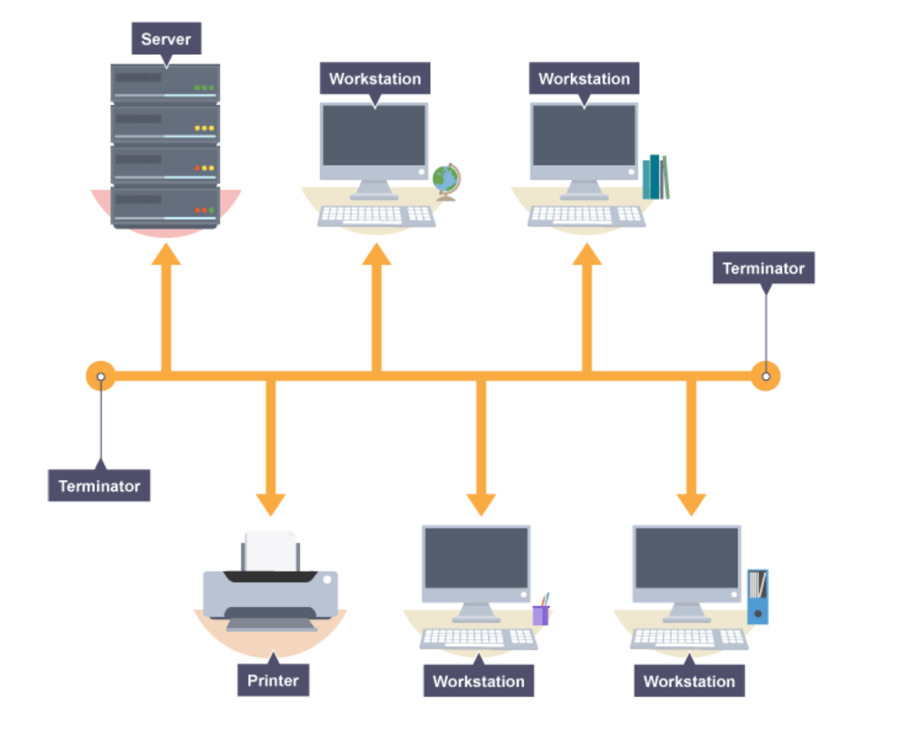
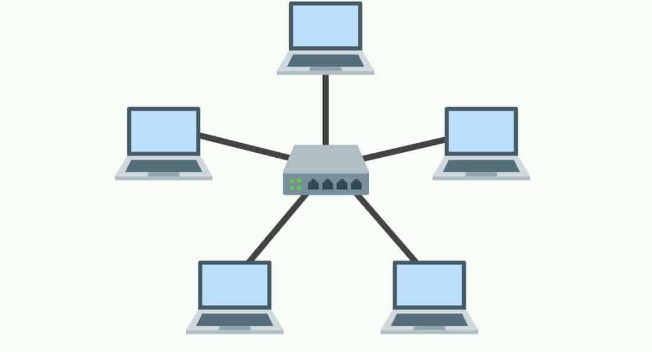
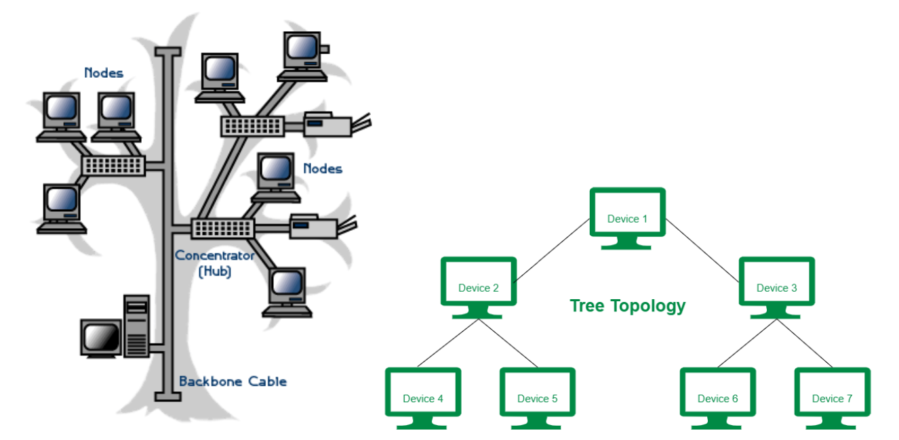
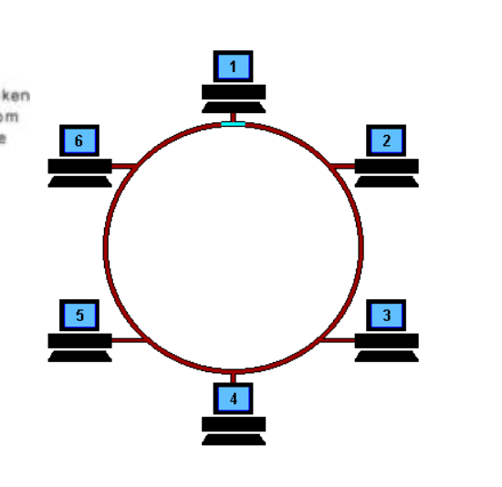

# 네트워크 토폴로지
- 노드와 링크가 어떻게 구성되어 있는지
___
 
 

## 버스 토폴로지
___

- 특징
  - 하나 회전, 여러개 노드
  - 노드 추가, 삭제 쉬움
  - 설치 비용 적음
- 장점 
  - 소규모 네트워크 구축 용이
  - 한 노드 장애 발생 -> 다른 노드 영향 x
- 단점
  - 메인 링크(하나의 회선 사용하니까)에 트래픽 많으면 정체현상 가능성 높음
  - 회선 하나니까 회선(링크) 망가지면 큰일    

___
 
 

## 스타 토폴로지
___

- 특징
  - 중앙 노드 기반으로 연결
  - 노드 추가 삭제 쉬움

- 장점
  - 중앙 노드 말고 다른 노드 문제 발생해도 다른 노드에 영향 x
  - 안정성 높음
    - 중앙 노드 아닌 다른 노드에 침투 당했을 때 중앙노드를 거치지 않고는 다른 노드로 가기 어려우니까 안전함 
    - 대신 중앙노드 보안을 최대로 하면 됨
  - 링크(유선 또는 무선)에 영향 생겨도 다른 나머지 부분엔 영향 x
- 단점
  - 중앙 노드 에러시 큰 문제      

___
 
 

## 트리 토폴로지 (계층적 토폴로지)
___

- 특징
  - 트리 형태
  - 리프 노드 기반으로는 노드 추가 삭제 용이
    - 다른 노드는 어려움
  - 버스 + 스타 토폴로지 (하이브리드 버전)
- 장점
  - 노드 확장 용이 (주로 리프노드에서)
  - 리프 노드 에러는 나머지 노드에 영향 x
- 단점
  - 특정 노드 트래픽 집중 시 하위 노드 영향 o
  - 루트 노드 문제 생기면 전체 네트워크에 큰 문제     

___
 
 

## 링형 토폴로지
___

- 특징
  - 노드 추가 삭제 쉬움
- 장점
  - 노드 수 많아져도 데이터 손실 x
    - 토큰 기반으로 옆에 노드로 계속 토큰 옮기면서 연속으로 권한 여뷰 따짐
    - 권한 없으면 데이터 전달받지 않고 통화
- 단점
  - 링크 또는 노드가 하나만 에러나도 전체 네트워크에 영향
  - 토큰 없는 노드는 참여 x 데이터 공유도 x
___
 
 

## 

