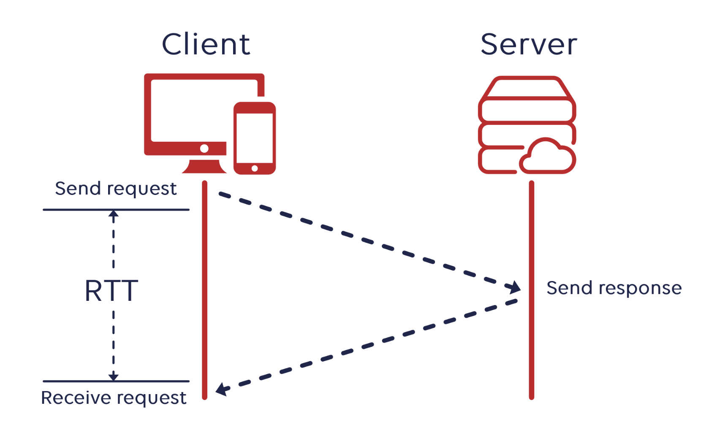

# 네트워크

- 네트워크란?     
노드와 링크가 서로 연결되어 있으며 리소스를 공유하는 집합
  - 노드 : 서버,라우터,스위치 등 네트워크 장치 (하드웨어 장치)
  - 링크 (엣지) : 유선 또는 무선 연결매체 (네트워크 장비를 연결해주는 선)
    - wifi
    - lan 선      

___
 
 

## 트래픽
___
- 특정 시점에 링크(유선 또는 무선)에서 **흐르는 데이터 양**

ex) 서버에 저장되어 있는 파일을 클라이언트가 다운로드 받을 때
- 이 때 발생하는 데이터의 누적량 - **트래픽**
 
 

### 트래픽과 처리량 차이
- 트래픽이 많아졌다 = 데이터가 많이 이동하고 있다.
- 처리량이 많아졌다 = 처리되는 트래픽이 많아졌다.
 
 

ex) 만약 100kb 이미지를 1000명이 다운로드 한다면 누적 트래픽?
- 특정 시점에 링크에 흐르는 데이터 양이 트래픽이므로 특정 시점에 1000명이 100kb 이미지를 다운받고 있으니까 1000*100 kb이다.
___
 
 

## 처리량
___
- 링크 (유선 또는 무선) 내에서 데이터 전송이 끝낸 트래픽 수
- 단위 : bps (bits per second) - 초당 전송 수 
 
 

### 처리량에 영향 미치는 요소
- 사용자들이 많을때마다 커지는 트래픽
- 네트워크 장치 간의 대역폭
- 네트워크 중간에 발생하는 에러
- 장치의 하드웨어 스펙
___
 
 

## 대역폭
___
- 최대 트래픽
- 특정 시점에서 네트워크 연결을 통해 흐를 수 있는 최대 데이터양(비트 수)
- 단위 : bps(트래픽과 처리량과 같음)
 
 

ex) 2차선 도로보다는 8차선 도로가 원활한 교통이 이루어짐
- 대역폭이 높을수록 빠른 서비스 제공
- 흔히 최대 동시 접속자 수라고 하는 데 이 지표의 유추 척도가 됨
___
 
 

## RTT (Round Trip Time : 완복 지연 시간)
___
- 신호를 전송하고 해당 신호에 답을 받는데 걸리는 시간     
(두 장치 간의 신호가 오고 가는 데 걸리는 시간)      

___

