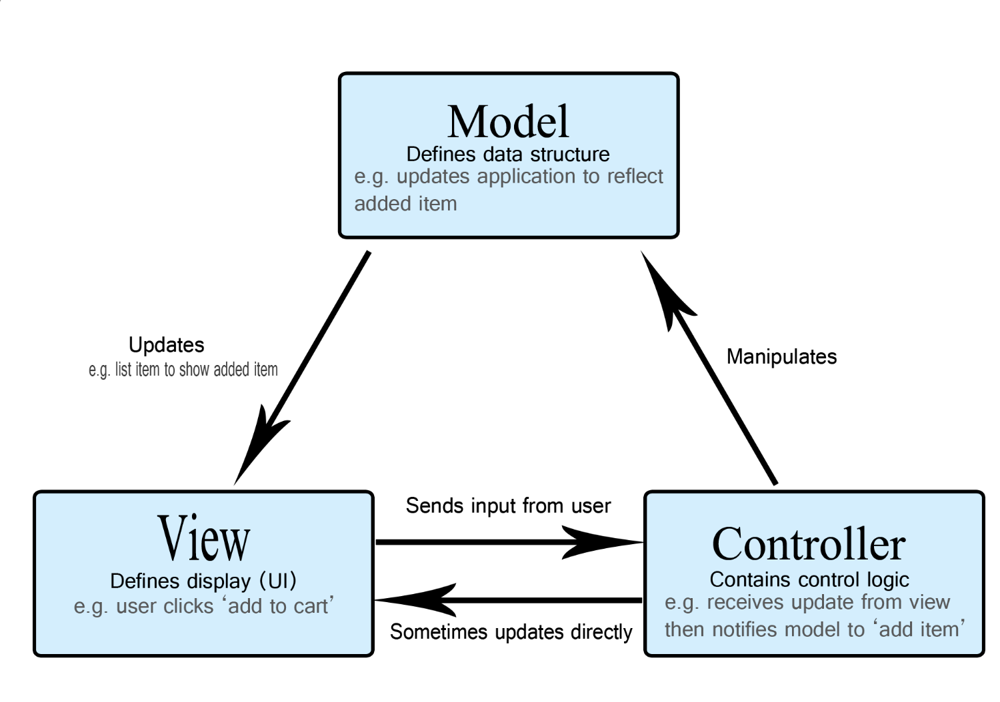

# MVC 패턴
- M : Model
- V : View 
- C : Controller 

- Model : 데이터 정의
- View : 사용자가 보는 UI
- Controller : Model 과 View를 연결 (로직 포함)     
 
 

## Model   
- 애플리케이션 데이터 관리          

뷰에서 데이터를 생성하거나 수정할 때 controller를 통해    
**Model**이 생성되거나 수정됨.
 
 

## View
- UI
- 모든 데이터는 Model로부터 가져온다.
- UI에는 데이터를 저장하지 않는다.
- 변경이 일어나면 **controller**에 변경을 전달        

**모델**을 기반으로 사용자가 볼 수 있는 화면
 
 

## Controller
하나 이상의 **뷰** 와 **모델**을 잇는 역할
- 메인 로직 담당
- 모델이나 뷰의 변경 감지를 입력 받아 로직 처리

 
 

## 장점
- 구성 요소를 3개로 나눠서 해당 요소에만 집중해서 개발
- 재사용성, 확장성 용이

## 단점
- 모델과 뷰 관계 복잡해질 수 있음.
 
 
 

# MVP 패턴
