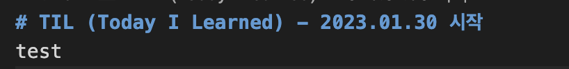
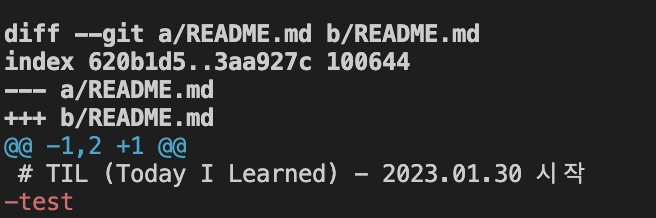

# Git
그날 그날 찾아봤던 git 내용 기록
___
<br/>
<br/>

# git fetch
원격 저장소에 있는 변경 사항들을  
로컬 저장소에 가져오기 전에   
변경 내용을 확인하고 싶을 때 사용하는 명령어
- 원격 저장소 변경 내용을 확인만 함
- 로컬에 적용되지는 않음      

## 상황 1 
### 1. main branch의 readme 파일에 test 문자 추가 후 push

### 2. 만약 나는 다른 브랜치에서 작업하고 있었고 이 사실을 몰랐다. 이 때 원격에 어떤 변경사항이 있는지 확인을 위해 git fetch 명령어 실행
```
git fetch origin(원격저장소 이름 쓰면 됨)
```
### 3. origin repository에서 main branch에 변경사항이 있다면
실제 변경사항 확인
```
git diff origin/main
```

- 사진에서 보이듯이 test 문자가 main branch가 아닌 지금 현재 branch에는 없고 main branch에는 있다는 것을 알 수 있다.  

### 4. 변경 사항을 로컬에 반영하고 싶으면 merge 진행
- 현재 branch에서 main의 변경 사항을 가지고 오고 싶은 것이므로
- 현재 branch로 checkout 후 main merge
    - (만약 반대라면 main 으로 checkout)
```
git checkout feature/#1/git
git merge main
```
### 5. readme.md 파일이 main과 똑같이 test 문자 추가됨  
<br/>
git fetch 후 변경 사항을 확인하고 merge 한다면      
git pull 하는 것과 같음

___  
<br/>
<br/>

# git Branch
### 1. github 사이트에서 branch 생성
### 2. git fetch 진행
```
git fetch
```
- branch가 변경 되었으니 fetch로 변경 사항을 확인할 수 있음
### 3. branch list 확인
```
git branch  (로컬 브랜치 목록 조회)
git branch -r  (원격 브랜치 목록 조회)
git branch -a  (모든 브랜치 목록 조회)
```
4. 원하는 branch로 이동하고 싶으면 checkout 실행
```
git checkout 브랜치_이름
```
___
<br/>
<br/>

# git stash
1번 branch에서 작업 중 2번 branch로 checkout할 일이 생겼다.   
이럴 때 2번 branch로 바로 checkout 하면 1번 branch에서 작업했던 내용들이 저장이 안된 체로 2번 branch로 넘어가게 된다.   
- 이럴 때 지금까지 작업했던 내용들을 잠깐 stack에 저장해 두기 위한 명령어다.

 <br/>

### stack에 넣기
```
git stash
```
<br/>

### stack에 저장된 내용 가져오기
```
git stash pop
```
<br/>

### git stash 후 stash된 내용들을 직접 확인하는 명령어
```
git stash show -p stash@{0}
```

이거 수정