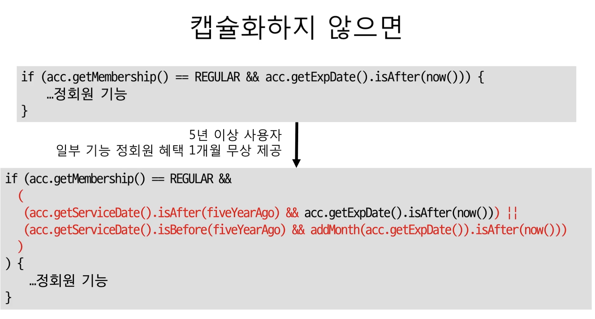
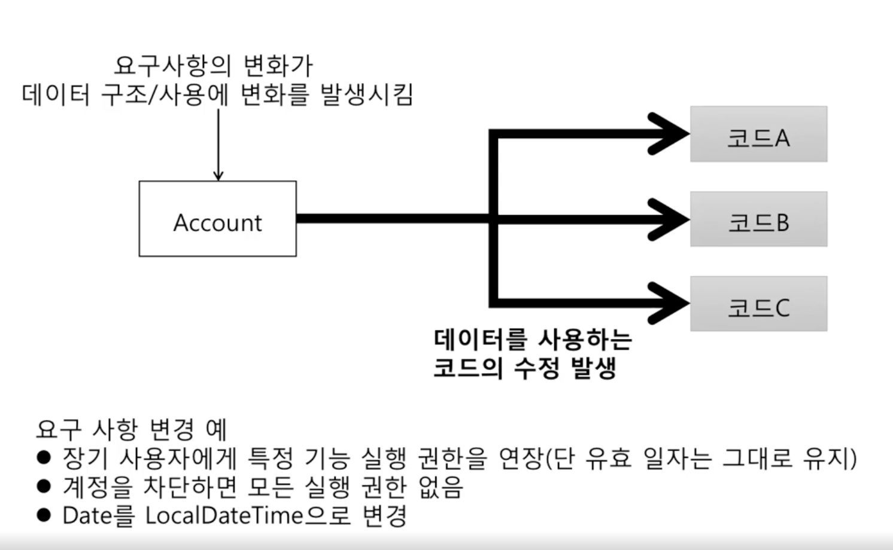
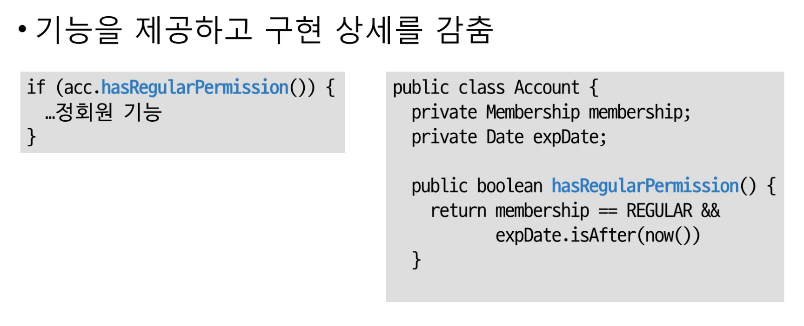
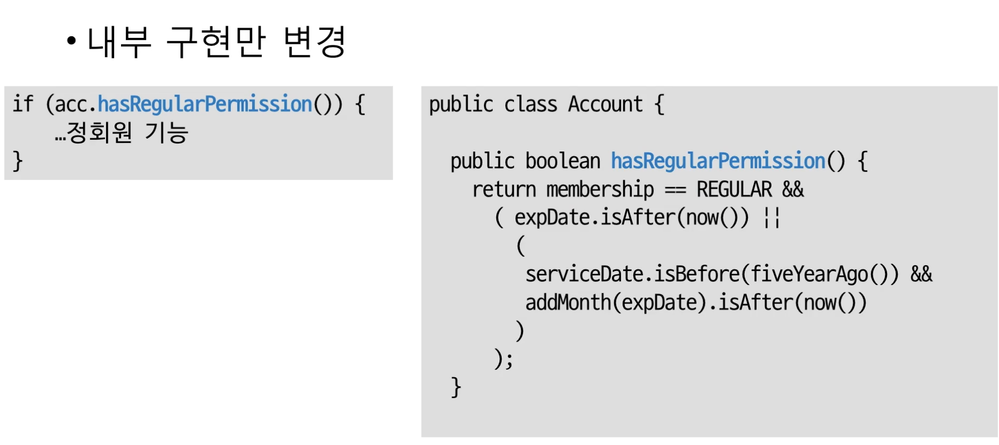
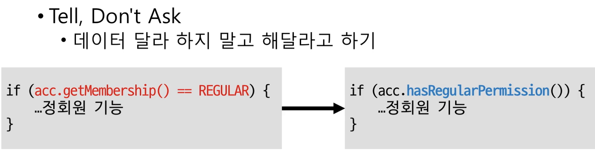
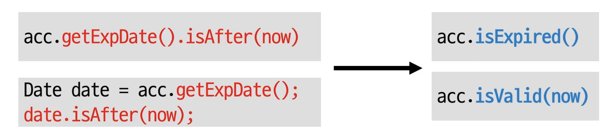

# 캡슐화

데이터 + 관련 기능 묶기
--
- 단 기능을 외부에서 볼 수 없도록 감춤
- 기능 구현과 관련된 내용을 감춤 (정보 은닉)
 
 
## 왜 캡슐화를 하는 걸끼?
- 외부에 영향 없이 객체 내부 구현 변경 가능
 
 
# 예시로 알아보자.
 

## 캡슐화를 안한 경우
___

코드를 보면 정회원인지 판단하기 위해  
원래는 조건 두개로 판단했는 데  
시간이 지나 조건이 3개가 더 추가가 되었다.  
이런 경우 위와 같이 코드를 고쳐야 하는데  
하나를 고치는 것도 어려운데 저렇게 고쳐야 되는 부분이 매우 많다면?  
 
 

- 캡슐화 하지 않는 경우
  - 요구사항이 변경되는 등 외부 환경이 변화하면 해당 내용에 관련된 모든 코드를 바꿔야한다.

 

## 캡슐화한 경우
___

- 왼쪽이 외부 오른쪽이 내부    
 

외부에서는 정회원인지 판별을 어떻게 하는지 알 수 없게 감추고    
Account라는 객체에 정회원 판별 기능을 넣어서  
정회원 판별을 원하면 해당 기능을 외부에서 호출만 하면 되게 구현했다.
 
 

### 여기서 정회원 판별 조건이 추가된다면?

- 외부에서 정회원 판별 코드는 바꿀 필요 없이 내부 기능 코드만 변경하면 된다.

## 따라서 캡슐화는 연쇄적인 외부 코드 수정을 최소화할 수 있다.
 
 

# 캡슐화를 위한 규칙

데이터를 받아와서 처리하지 말고 기능(메서드)을 호출해라.
--

- 왼쪽과 같이 데이터를 get으로 받아와서 정회원일지 판별하지 말고  
- 오른쪽과 같이 정회원을 판별하는 기능(메서드)를 내부적으로 만들어서 외부에선 메서드만 호출하면 되게끔 하라.

___
Demeter's Law
--
- 메서드에서 생성한 객체의 메서드만 호출
- 파라미터로 받은 객체의 메서드만 호출
- 필드로 참조하는 객체의 메서드만 호출  
 

즉 해당 객체의 메서드의 메서드의 ...  
혹은 해당 객체의 메서드의 데이터의 메서드의 ...   
이렇게 하지 말고 **객체.메서드** 로 끝내라는 뜻

- 왼쪽은 acc 객체의 메서드의 또다른 메서드를 호출했다. 이러지 말라....
- 오른쪽과 같이 내부 메서드를 또 새로 만들어서 외부에서 하나의 메서드로 끝내게끔 하는 것이 좋다.
___
# 정리

- 캡슐화 : 기능의 구현을 외부에서 볼 수 없게끔 감춤
- 이점:
  - 수정 사항이 생길 시 해당 기능(메서드)을 호출하는 외부 기능은 변경할 필요 없다. 내부 기능(메서드)만 수정하면 된다.
